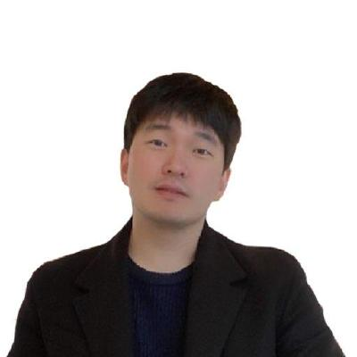

## About Me

Hi! I am a MS/Ph.D student in the Department of Artificial Intelligence at Korea University. My advisor is Prof. <a href="https://scholar.google.com/citations?hl=en&user=VJuuzLwAAAAJ">Christian Wallraven</a>, and I am part of the <a href="http://cogsys.korea.ac.kr/Cognitive_Systems.html">Cognitive Systems Lab</a>. 

- Phone : +82-10-5134-3621
- E-mail: minsuksung@korea.ac.kr
- blog: minsuksung-ai.tistory.com

Please contact me if you want to know more about me!  See CV for more information.

 <!-- This is a jekyll based resume template. You can find the full source code on [GitHub] --> 
 <!-- (https://github.com/bk2dcradle/researcher) -->

---

## Education
- Department of Computer Engineering, Hongik University (Mar. 2014 ~ Feb. 2020)
- SOAS, University of London (Sep. 2016 ~ Dec. 2016)
- Department of Artificial Intelligence, Korea University - Integrated Master-Ph.D. Student (Mar. 2020 ~ Current)

---

## Research Interest
- Machine Learning
- Deep Learning
    - Object Detection
    - Bayesian Neural Network
    - Uncertainty
- Reinforcement Learning
    - Distributional RL
- Financial Engineering
    - Optimized Trade Execution
    
---

## Publications
### International Conference
- Ha Yoon Song, Moo Sang Beak, Minsuk Sung, “Generating Human Mobility Route Based on Generative Adversarial Network”, Federated Conference on Computer Science and Information Systems(FedCSIS),  2019.

### Domestic Conference
- Minsuk Sung, Ha Yoon Song, “Prediction on Visited Stations through the Analysis of Individual Movements Data”, Korea Institute of Information Scientists and Engineers, 2019

---

## Activity
### PRML Lab - Integrated Master-Ph.D. Student (Jan. 2020 - Oct. 2020)
- Minimizing slippage/implemention shortfall on optimized trade execution using reinforcement learning

### Undergraduate student, PEM Lab (Mar. 2018 ~ Feb. 2020)
- Combining Human Mobility Data with Machine Learning/Deep Learning

### Hongik University Algorithm Club **HIARC** (Mar. 2018 ~ Feb. 2019)
- Data Science From Scratch Study
- Algorithm Elementary/Medium Study

### Python Programming Using Big Data, **Samsung MultiCampus** (Jan. 2019 ~ Feb. 2019)
- Basic Python
- Web Programming with Flask
- Building database using MySQL

### Big Data University Union Club **BOAZ** - *management staff* (Jan. 2019 ~ Jan. 2020) [GitHub](https://github.com/minsuk-sung/ssmc_python_using_bigdata)
- Web Crawling Lecture Using BeautifulSoup and Selenium
- Basic Lecture for Convolutional Neural Network (CNNs)
- Basic Lecture for kaggle using Titanic Dataset
- Basic Lecture for Deep Learning Framework (TensorFlow, PyTorch, Keras)
- [Machine Learning Study - HandsOnMachineLearning](https://github.com/mssung94/Hands-On-MachineLearning )
- [Deep Learning Study - Deep Learning from scratch](https://github.com/mssung94/deep-learning-from-scratch)
- [BOAZ Graduation Project - Real Time Violence Detection](https://github.com/mssung94/boaz-adv-project)
    - https://youtu.be/MV_4RITXXL4 
  
### Python-based Big Data Analysis Processing, Korea Data Industry Promotion Agency (Jul. 2019 - Aug. 2019) [GitHub](https://github.com/minsuk-sung/yonsei-data-campus)
- Simple data analysis with Numpy and Pandas
- Visualizing Data with Matplotlib and Seaborn
- Pre-processing and Machine Learning Modeling with Scikit-Learn
- Deep Learning Modeling Using Tensorflow and Keras Deep Learning Framework

### 1st Drone Festival, Intel Korea (Aug. 2019)
- Drone driving training through Tello drones
- Completion of basic object recognition education through OpenVINO and Caffe
- Modifying the learned deep learning model to MobileNet to complete additional labs

### Lecture for Image Classification, Intel Korea (Nov. 2019 ~ Feb. 2020) [GitHub](https://github.com/mssung94/intel-image-classification)

### Lecture for Object Detection, Intel Korea (Mar. 2020 ~ Current) [GitHub](https://github.com/minsuk-sung/intel-object-detection)

---

## Honors & Awards

|Year|Award|Organization|Place|  
|:-----:|-------|----|----|
|Dec. 2020|[제4회 빅데이터 페스티벌](https://programmers.co.kr/competitions/252/2020-miraeasset) | 미래에셋대우 | **우수상**(2등) |
|Jun. 2020|[생체 광학 데이터 분석 AI 분석대회](https://dacon.io/competitions/official/235608/overview/) | DACON | 7등 / 696등 |  
|Apr. 2020|[공공 데이터 활용 온도 추정 AI 경진대회](https://dacon.io/competitions/official/235584/overview/) | DACON | 2등 / 1,081등 |  
|Nov. 2019|[제3회 빅데이터 페스티벌](https://www.miraeassetdaewoo.com/mobilew/fest/mwUnivFestmain.jsp) | 미래에셋대우 | **금상** |  
|Nov. 2019|[제7회 빅콘테스트](https://www.bigcontest.or.kr/introduce/history2019.php) | 과학기술부 / 한국정보화진흥원 | **최우수상** |  
|Sep. 2019|우주전파재난 예측 AI 경진대회 | 국립전파연구원 | 본선 7등 |  
|Mar. 2019|서울 하드웨어 해커톤 | 서울산업진흥원(SBA) | 3등 |  

---

## Patents

|Year|Contents|  
|:-----:|-------|  
|2018|Optimization of Route Using Delivery Hub|  
|2019|Prediction of Human Path using GAN|  

 <!-- This is a [link](http://google.com). Something *italics* and something **bold**.-->
 <!-- Here is a horizontal rule --- -->
 <!-- Here is a blockquote> To a great mind, nothing is little -->
